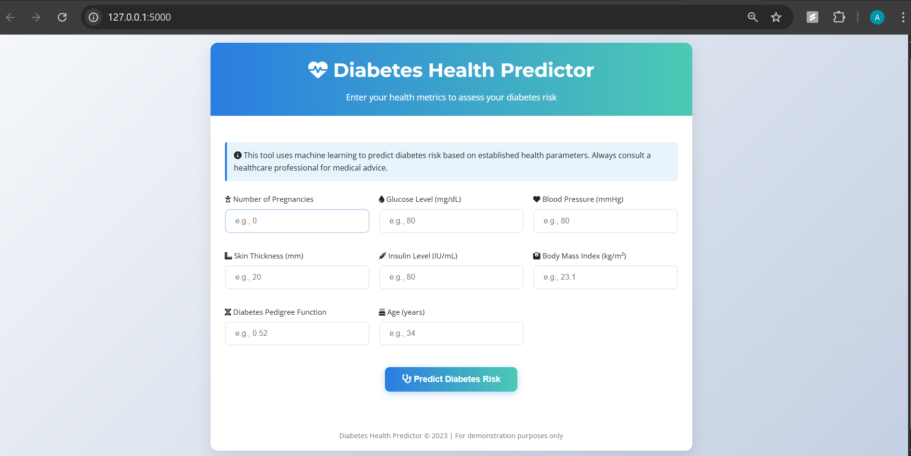
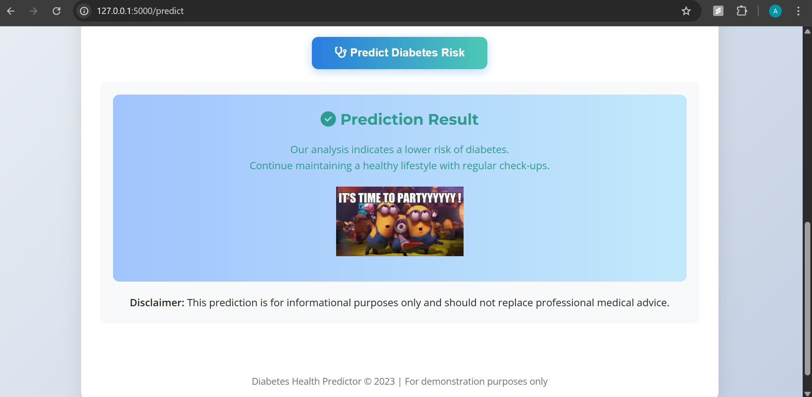
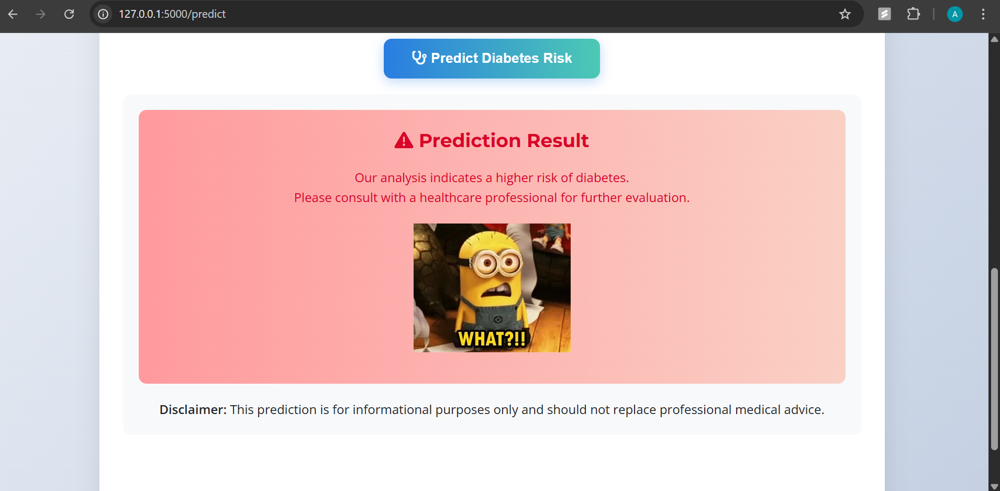

# Diabetes Predictor - Flask Web Application

## Overview

The Diabetes Predictor is a machine learning-based web application that assesses an individual's risk of diabetes based on key health metrics. Built with Flask and Python, this application provides an intuitive interface for users to input their health data and receive an immediate prediction about their diabetes risk status.





## Features

- **User-Friendly Interface**: Clean, professional design with medical-themed aesthetics
- **Real-time Predictions**: Instant diabetes risk assessment using a trained ML model
- **Responsive Design**: Works seamlessly on desktop, tablet, and mobile devices
- **Test Data Options**: Pre-loaded test values for both positive and negative diabetes cases
- **Visual Feedback**: Color-coded results with appropriate imagery
- **Form Validation**: Input validation with appropriate ranges for each health parameter

## Technology Stack

- **Backend**: Python, Flask
- **Frontend**: HTML5, CSS3
- **Machine Learning**: Scikit-learn

## Installation and Setup

### Prerequisites

- Python 3.8 or higher
- pip (Python package manager)

### Step-by-Step Installation

1. **Clone or download the project files**

   ```bash
   git clone https://github.com/DevarajuAlugolu/diabetes-predictor
   cd diabetes-predictor
   ```

2. **Create a virtual environment (recommended)**

   ```bash
   python -m venv venv
   source venv/bin/activate  # On Windows: venv\Scripts\activate
   ```

3. **Install required dependencies**

   ```bash
   pip install -r requirements.txt
   ```

4. **Ensure you have the trained model file**

   - Place your `diabetes_model.joblib` file in the project root directory

5. **Run the application**

   ```bash
   python app.py
   ```

6. **Access the application**
   - Open your web browser and navigate to `http://localhost:5000`

## API Endpoints

- `GET /` - Renders the main form page
- `POST /predict` - Processes form data and returns prediction
